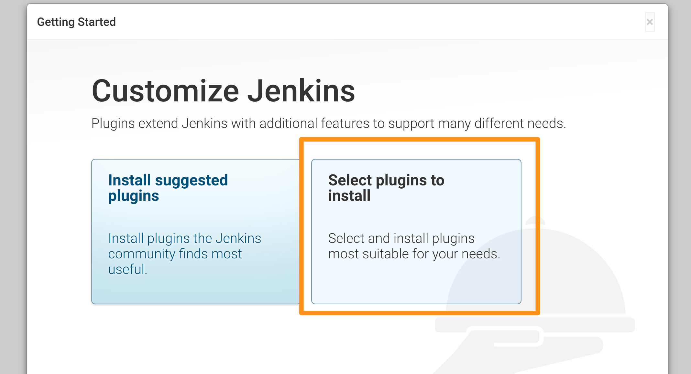

# JENKINS

Jenkins is a essential automation tool to setup Continuous Integration. Its the integrator which helps you build your development,  testing and deployment  workflow and create job pipelines. It also adds visibility to all stake holders including the Dev, QA, Ops teams involved in building, testing and deploying the product.

## Setting up Learning Environment with Docker
This is the easiest method to setup Jenkins and is a recommended option.  

### Installing Docker Engine

Proceed with installing Docker Engine on your choice of Operating System. For details on how to install docker visit the official installation page at  [docs.docker.com](https://docs.docker.com/engine/installation/).

We assume you have installed docker and are ready to launch containers before proceeding. To validate docker environment run.

```
docker ps
```

If the above command goes through without errors, you are all set.

After installing docker, pull our Jenkins docker image from [docker hub](https://hub.docker.com/_/jenkins/).

This is the simplest way of installing Jenkins and requires minimal efforts.

```
docker run -idt --name jenkins -v jenkins_home:/var/jenkins_home  -v /var/run/docker.sock:/var/run/docker.sock  -p 8080:8080 -p 50000:50000 jenkins/jenkins:slim
```

To access jenkins click the `+` at the top of the Katacoda page, click "Select port to view on Host1" and type in 8080.

This will load a new page with jenkins.

## Common Post Installation Steps

After the installation, you will be asked for password. The password is available through Docker logse.

```
docker logs jenkins
```


Click on  **Select Plugins to Install** when given an option.



This will let you choose the plugins to install on the next page. On the selection page,
  * Click on **None** to deselect all plugins
  


Create Admin user


Now we have successfully installed Jenkins and we can proceed with configurations


-----

:point_right: [**Next** Chapter 3: Configure Jenkins](030_configure_jenkins.md)
